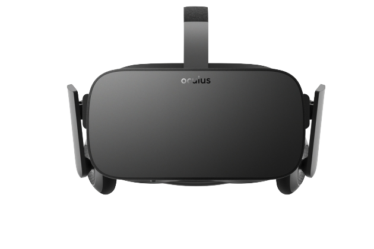

# Oculus Rift
 []()
 []()
 []()
 
  

  
This is a school project based on the Oculus Rift website. It is a front-end dev
  
[See the demo](https://oculus-rift.netlify.com/)

[]()
  

## How to 🎉
  
### Installation 📦 
First, do not forget to install [Node.js](https://nodejs.org/en/) and [Yarn](https://yarnpkg.com/en/docs/install). 
After downloaded the repository, install the node_modules with : 

```
yarn install
```

### Running the app 🚀
To run the app, run this command in your terminal :
```
yarn run dev
```

Then browser-sync should start and you should be able to see the app.


### Build it 👷
To build it, run this command in your terminal :
```
yarn run build
```


## Precisions 📝
- We used the [BEM](http://getbem.com/naming/) naming class convention.
- For the CSS, we added [CSSComb](https://github.com/csscomb/csscomb.js) to format and sort our code.
- For the Javascript, we used [ESLint](https://github.com/eslint/eslint) and code in ES6. 
- We liked to use [gitmoji](https://github.com/carloscuesta/gitmoji/) when we commited to identify quickly the purpose of the commit 
- Everytime we could, we followed the rules of [FrontEndChecklist](https://frontendchecklist.io/)


## Other 🔎 
  
### Thanks 👥

To the design team :
- [Léna Mari](https://www.behance.net/lenammari)
- [Valentin Martinez](https://www.behance.net/valentinma2045)
- [Kimberly Busson](https://www.behance.net/kimberlybu7657)
 
and the two other developers :
- [Samuel Mormin](https://github.com/samuelmormin)
- [Rayan Aït-Tayeb](https://github.com/Rayan94)
  
### Licence 📄
This repository is under MIT Licence.